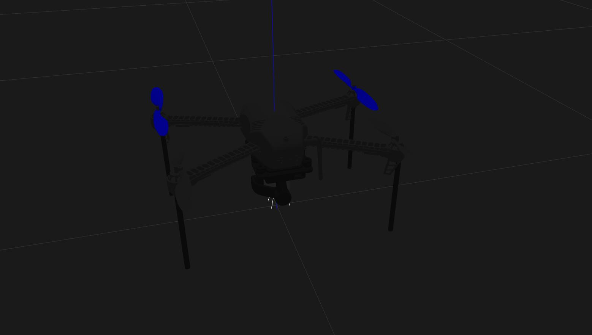

# Autonomous Drone using SITL ROS and gazebo simulation

Drone Programming using mavros and ROS and simulation environments like SITL and Gazebo is a centralized repository that houses a wealth of information, including code snippets and installation instructions, for enthusiasts and developers interested in drone programming. This comprehensive resource covers essential topics such as SITL, Gazebo, ROS, mavros, DroneKit, pymavlink, and more. Whether you are a beginner seeking guidance on installations or an experienced developer looking for code examples, this repository is designed to cater to a wide range of needs in the drone programming community. Dive into the world of UAVs with confidence, leveraging the power of mavros and ROS in conjunction with realistic simulations provided by SITL and Gazebo.

# Prerequisite Installation
- [Ubuntu 20.04]()
- [ROS Neotic]()

# mavros Installation
- First update and upgrade the System (Ubuntu 20.04).
```bash
  sudo apt update
  sudo apt upgrade
```
- Installing python3 and pip3.
```bash
    sudo apt-get install python-dev python-pip python3-dev python3-pip python3-rospkg

```
- Install MAVProxy with pip in python2
```bash
    pip install MAVProxy
```
- Use apt-get for installation, where ${ROS_DISTRO} below should resolve to  noetic, depending on your version of ROS
```bash
    sudo apt-get install ros-${ROS_DISTRO}-mavros ros-${ROS_DISTRO}-mavros-extras ros-${ROS_DISTRO}-mavros-msgs
```
- Then install GeographicLib (opens new window) datasets

```bash
  wget https://raw.githubusercontent.com/mavlink/mavros/master/mavros/scripts/install_geographiclib_datasets.sh
  sudo bash ./install_geographiclib_datasets.sh   
```

# SITL Installation
## Setting up the build environment in Linux
- First update and upgrade the System (Ubuntu 20.04).
```bash
  sudo apt update
  sudo apt upgrade
```
- Install git to the computer.
```bash
  sudo apt-get install git gitk git-gui
```
- Configure git to use HTTPS instead of git.
```bash
  git config --global url."https://github.com/".insteadOf git@github.com:
  git config --global url."https://".insteadOf git://
```
- Clone the ardupilot repository from github.
```bash
  cd && git clone https://github.com/ArduPilot/ardupilot.git
```
- Perform submodule updates.
```bash
  cd ardupilot/
  git submodule update --init --recursive
```
- Install required packages.
```bash
  Tools/environment_install/install-prereqs-ubuntu.sh -y
```
- Update profile.
```bash
  . ~/.profile
```
- This will install all the required Linux system packages and python modules.
``` bash
curl -s -L https://raw.githubusercontent.com/mustafa-gokce/ardupilot-software-development/main/environment-setup/quickstart.sh | /usr/bin/bash
```
## Setting up the simulation software in Linux

- Get into the ardupilot project directory.
```bash
cd && cd ardupilot/
```
- Update profile.
```bash
. ~/.profile
```
## Copter simulation in Linux

- Go into the ArduCopter directory.
```bash
cd && cd ardupilot/ArduCopter/
```
- Start the simulation with wiping the virtual EEPROM option to load correct parameters.
```bash
sim_vehicle.py -w
```

- After simulation has started, press Ctrl+C and start the simulation normally.
```bash
sim_vehicle.py --console --map
```

# Gazebo Installation
- Setup your computer to accept software from http://packages.osrfoundation.org:
```bash
sudo sh -c 'echo "deb http://packages.osrfoundation.org/gazebo/ubuntu-stable `lsb_release -cs` main" > /etc/apt/sources.list.d/gazebo-stable.list'
```
- Setup keys:
```bash
wget http://packages.osrfoundation.org/gazebo.key -O - | sudo apt-key add -
```
- Reload software list:
```bash
sudo apt update
```
- Install Gazebo:
```bash
sudo apt-get install gazebo11 libgazebo11-dev
```
## Install Gazebo plugin for APM (ArduPilot Master) :

```bash
cd ~
git clone https://github.com/khancyr/ardupilot_gazebo.git
cd ardupilot_gazebo
```
- build and install plugin
```bash
mkdir build
cd build
cmake ..
make -j4
sudo make install
```
```bash
echo 'source /usr/share/gazebo/setup.sh' >> ~/.bashrc
```
- Set paths for models:
```bash
echo 'export GAZEBO_MODEL_PATH=~/ardupilot_gazebo/models' >> ~/.bashrc
. ~/.bashrc
```
# Run Simulator
### NOTE the iris_arducopter_runway is not currently working in gazebo11. The iq_sim worlds DO work

- In one Terminal (Terminal 1), run Gazebo:
```bash
gazebo --verbose ~/ardupilot_gazebo/worlds/iris_arducopter_runway.world
```
- In another Terminal (Terminal 2), run SITL:
```bash
cd ~/ardupilot/ArduCopter/
sim_vehicle.py -v ArduCopter -f gazebo-iris --console
```
- In another Terminal (Terminal 3), run mavros:
```bash
roslaunch mavros apm.launch fcu_url:=udp://:14550@
```
## Screenshots


- After this Follow the Youtube Video Tutorials 
